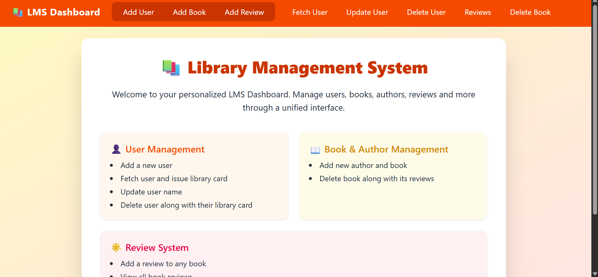
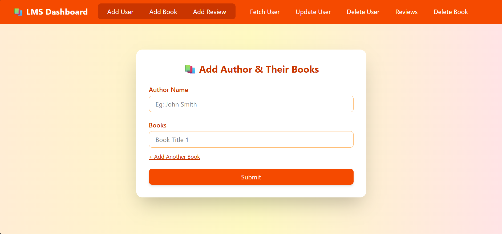
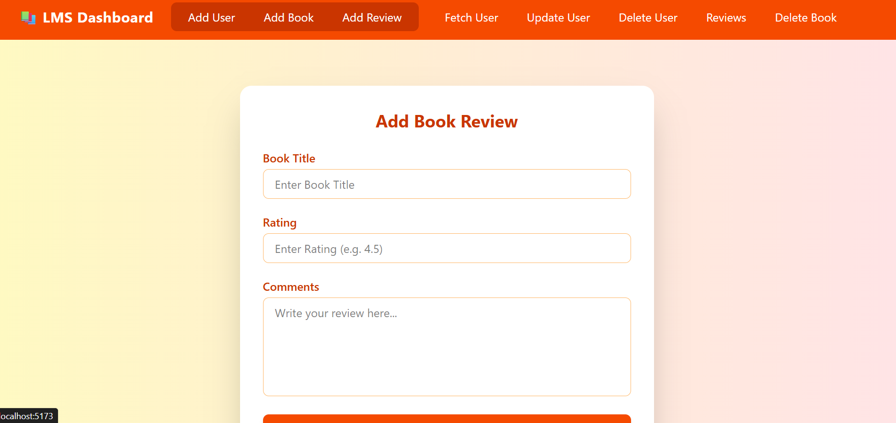

# 📚 Library Management System

A **Full-Stack Library Management System** built using **Java Spring Boot** (Backend) and **React.js** (Frontend) with **PostgreSQL** as the database.  
The system is designed to handle complete library operations — from managing users and library cards to handling books, authors, and reviews.

---

## 🚀 Tech Stack

**Frontend:**  
- React.js (Fully Responsive UI)  
- Tailwind CSS / Custom CSS (Responsive Styling)  

**Backend:**  
- Java Spring Boot (REST API)  
- Spring Data JPA  
- PostgreSQL (Relational Database)  

**Tools & Others:**  
- Maven (Dependency Management)  
- Postman (API Testing)  
- Git & GitHub (Version Control)

---

## 📂 Entities in the System

1. **User**
2. **LibraryCard**
3. **Author**
4. **Book**
5. **Review**

---

## ✨ Features & User Stories

- 👤 **User Management**
  - Add a new user & issue a library card instantly  
  - Delete a user along with their associated library card  

- 🏷️ **Author & Book Management**
  - Add authors and their associated books  
  - Delete books and all associated reviews  

- 📝 **Review Management**
  - Add a review for a book  
  - Delete a review  
  - Fetch all reviews of a particular book  
  - Fetch all reviews in the system  

- 📊 **Other Functionalities**
  - Complete CRUD operations on all entities  
  - Validations for required fields  
  - Fully REST API-based architecture

---

## 📸 Screenshots

| Home Page | Book Listing | Add Review |
|-----------|--------------|------------|
|  |  |  |

*(Add screenshots of your UI in the `assets/` folder and update paths above.)*

---

## 🛠️ Installation & Setup

### Backend Setup (Spring Boot + PostgreSQL)
```bash
# Clone the repository
git clone https://github.com/your-username/library-management-system.git
cd library-management-system/backend

# Configure PostgreSQL in application.properties
spring.datasource.url=jdbc:postgresql://localhost:5432/your_database
spring.datasource.username=your_username
spring.datasource.password=your_password

# Run backend
mvn spring-boot:run
